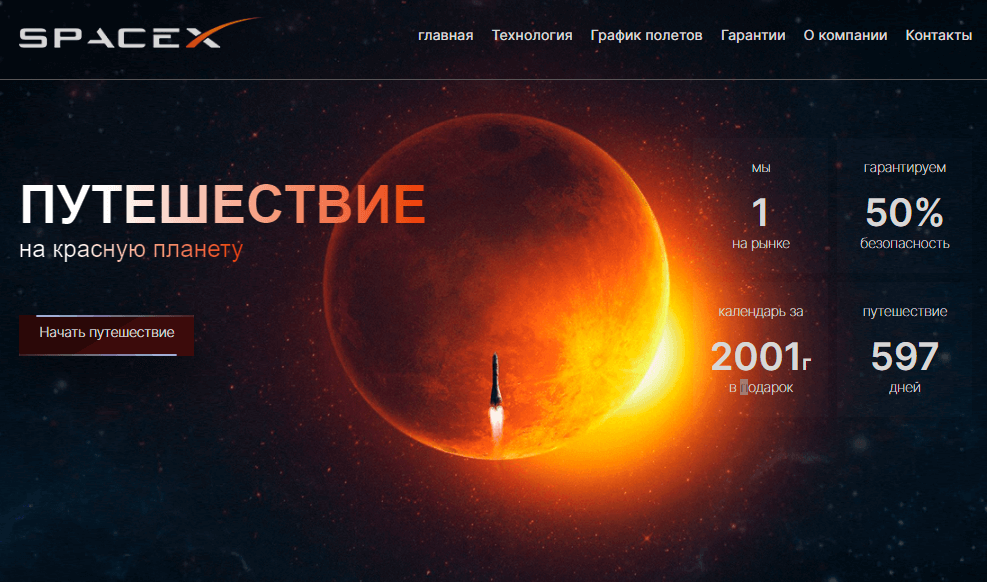

# Проэкт:Mesto-React (с регистрацией и авторизацией)

- [Ссылка на проект](https://vladimir-snimshikov.github.io/test-task-main-page-spacex/)

## Обзор

Тестовое задание в виде макета первого экрана главной страницы

## Функционал

- Адаптивная верстка
- Выезжающее меню для мобильной версии
- Анимации

## Использованные технологии:

- React,
- JAVASCRIPT,
- Redux,
- react-router-dom',
- HTML,
- CSS,

## Быстрый запуск:

- npm install
- npm start
